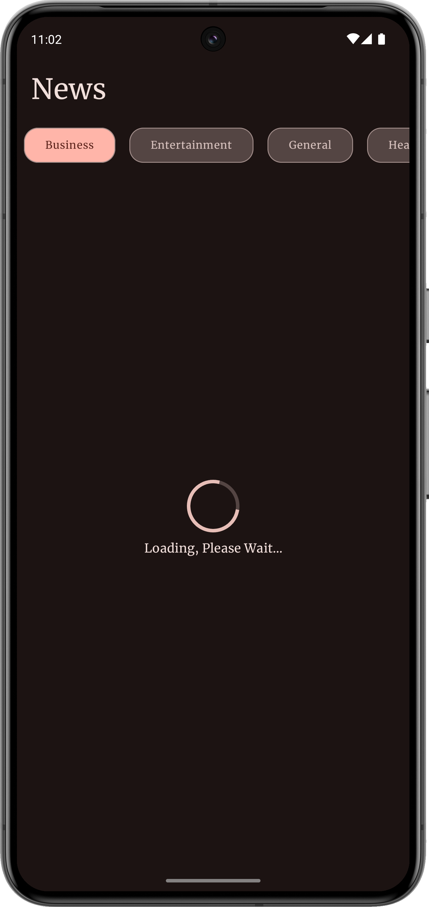

# News App

## Overview

The News App is a modern, efficient news reading application built using Jetpack Compose, Retrofit, and Coroutines. It fetches news data from a REST API and displays it in a clean, user-friendly interface. The app uses **MVVM** architecture with **Clean Architecture** principles for maintainability, and incorporates **Moshi** for JSON parsing and **Coil** for image loading. **Material Design** components are used for consistent UI elements.

## API Source

The app retrieves news data from the free [News API](https://saurav.tech/NewsAPI/), which is used solely for development and demonstration purposes.

## Key Technologies & Learnings

- **Jetpack Compose**: Declarative UI framework for building modern, flexible UIs with composables.
- **Material Design**: Applying Material Design components for consistent and polished UI.
- **ViewModel**: Managing UI-related data lifecycle-consciously, providing a clear separation of concerns.
- **MVVM**: Structuring the app to separate the UI from business logic and data layers for better testability and maintainability.
- **Clean Architecture**: Organizing the codebase into layers for scalability and easier maintenance.
- **REST API & Retrofit**: Fetching news data from a REST API using Retrofit, ensuring efficient network calls.
- **Coroutines**: Running background tasks such as API calls and data processing asynchronously without blocking the main thread.
- **Moshi**: A modern JSON library used to parse the data from the REST API.
- **Coil**: Efficiently loading images (like article thumbnails) into the UI with Coil, reducing memory usage and improving performance.

## Screenshots

  &nbsp;&nbsp;
  &nbsp;&nbsp;
  &nbsp;&nbsp;
  

  &nbsp;&nbsp;
  &nbsp;&nbsp;
  

